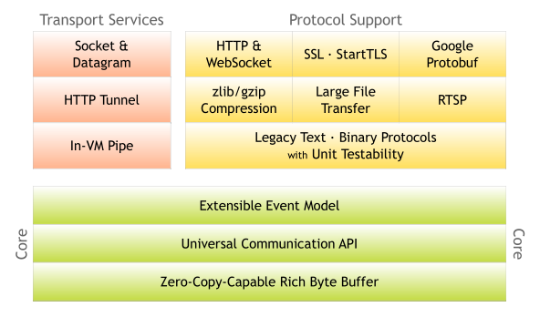

# 学习清单

## netty

1. [Netty 源码解析之 Channel](https://www.jianshu.com/p/c0c0a0c5c0c0)

2. [Netty 源码解析之 Bootstrap](https://www.jianshu.com/p/c0c0a0c5c0c0)

3. https://netty.io/

## 原理

## 写一个netty服务器

MyServer.java

管道处理器： MyChannelHandler.java

## 写一个netty客户端

MyClient.java
MyClientHandler.java

连接管道，并发送消息

## 如何传输值对象

1. 编码器：CarEncoder.java,继承自MessageToByteEncoder，解码器：CarDecoder.java，继承自ByteToMessageDecoder
2. 对象必须实现Serializable接口
3. netty服务端和客户端必须设置一个编解码器

通过定义对象、实现编码器和解码器，并在 Netty 管道中配置它们，你可以轻松地在 Netty 4.2.2 中传输对象。
见car包 中

## 如何监听服务端和客户端的连接和断开

## 如何实现心跳

## 如何传输文件

## 如何实现文件上传

